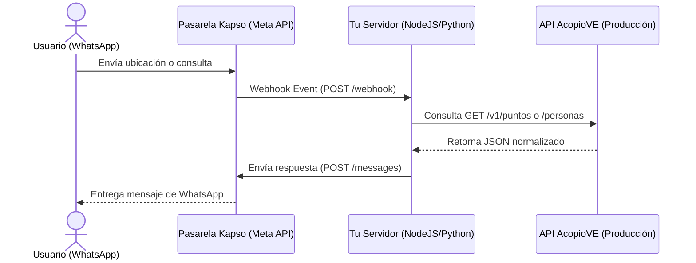

# Guía: Integración de Chatbot de WhatsApp con Kapso y AcopioVE

En situaciones de desastre y emergencia humanitaria, la conectividad puede ser muy precaria. Un asistente virtual o chatbot de WhatsApp permite a los usuarios afectados encontrar información vital (como refugios cercanos, acopios y teléfonos de emergencia) de forma rápida, directamente desde su celular y consumiendo una fracción mínima de datos.

Esta guía describe cómo conectar la API pública de AcopioVE con la pasarela de WhatsApp oficial de Kapso para armar tu propio asistente de ayuda.

---

## Arquitectura del Flujo

El patrón de mensajería interactiva sigue un flujo de tres actores:



1. **Usuario:** Envía un mensaje (de texto, comando o comparte ubicación GPS) al número de WhatsApp.
2. **Kapso:** Recibe el mensaje a través de la infraestructura oficial de Meta y realiza una petición `POST` (evento de webhook) a tu servidor de aplicaciones.
3. **Tu Webhook:** Procesa el texto o las coordenadas, realiza una petición `GET` a la API de AcopioVE para buscar los datos correspondientes, construye un texto legible de respuesta y le indica a Kapso que lo envíe de vuelta al usuario.

---

## Paso a Paso para Implementarlo

### Paso 1: Onboarding del número en Kapso
1. Crea una cuenta en Kapso.ai.
2. Vincula un número telefónico de tu propiedad con la API de WhatsApp Cloud de Meta siguiendo el flujo de onboarding provisto.
3. Copia tus credenciales desde el panel de Kapso:
   * **WABA ID** (WhatsApp Business Account ID)
   * **API Key** (para firmar tus peticiones salientes)

### Paso 2: Configurar tu Webhook
Para que tu servidor reciba los mensajes en tiempo real:
1. Expón un endpoint en tu servidor (ej. `POST https://tudominio.com/webhook`).
2. Configura esta URL en el panel de control de Kapso dentro de la sección de Webhooks, seleccionando el evento de mensajes entrantes.

### Paso 3: Consumir la API de AcopioVE según la solicitud
Cuando tu servidor reciba el webhook, parsea el contenido y consulta el endpoint correspondiente de `api.acopiove.org/v1/`:

* **Refugios o Centros Cercanos:** Si el usuario comparte su ubicación de WhatsApp, extrae las coordenadas `latitude` y `longitude` y llama al endpoint unificado:
  ```http
  GET https://api.acopiove.org/v1/puntos?tipo=refugio&near=lat,lng&radius=15&limit=3
  ```
* **Líneas de Emergencia:** Si el usuario escribe palabras clave como "emergencia" o "telefono", consulta:
  ```http
  GET https://api.acopiove.org/v1/puntos?tipo=telefono&limit=5
  ```
* **Búsqueda de Familiares (Reunificación):** Si el usuario escribe "buscar Juan Pérez", procesa el nombre y consulta:
  ```http
  GET https://api.acopiove.org/v1/personas?q=Juan%20Perez
  ```
  *(Nota: Este endpoint devuelve datos PII-seguros: las cédulas están enmascaradas, se omiten coordenadas de personas y se ocultan ubicaciones de menores de edad para preservar la seguridad).*

---

## Ejemplo Práctico de Código

En la carpeta examples/ tienes a tu disposición un código de servidor funcional e ilustrativo en JavaScript:

[whatsapp_webhook.js](../examples/whatsapp_webhook.js)

Este código demuestra cómo estructurar las condiciones lógicas de respuesta y cómo realizar peticiones HTTP de forma nativa para responder al usuario.

---

## Gestión de la Ventana de 24 horas (Meta)

Es muy importante tener en cuenta las políticas de mensajería comercial de Meta WhatsApp:
* **Mensajes de Sesión (Gratuitos/Libres):** Cuando un usuario escribe un mensaje a tu número de WhatsApp, se abre una ventana de interacción de 24 horas. Durante esta ventana, tu servidor puede responder con cualquier texto libre (sin plantillas) utilizando la API de Kapso.
* **Mensajes de Plantilla (Fuera de Ventana):** Si deseas iniciar una conversación o enviar una actualización al usuario transcurridas las 24 horas del último mensaje, Meta exige que envíes un mensaje estructurado basado en una plantilla pre-aprobada en su portal.
