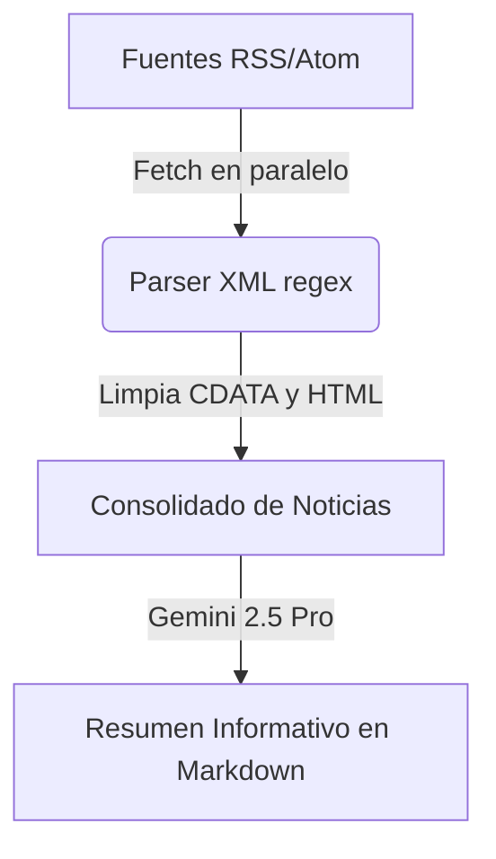

# 📰 Recopilador y Resumidor de Prensa con IA (News Summarizer)

Este módulo contiene la lógica para descargar feeds de noticias en formato RSS/Atom de múltiples medios de comunicación en paralelo, parsear y limpiar sus contenidos de forma ligera sin dependencias externas pesadas, y generar un **Resumen Informativo Diario** estructurado y consolidado utilizando **Gemini 2.5 Pro**.

---

## 🛠️ Arquitectura y Componentes

La herramienta está compuesta por dos partes principales:
1. **Parser XML RSS/Atom Adaptativo:** Descarga los boletines y extrae las noticias más recientes limpiando el formato (HTML/CDATA).
2. **Asistente de Síntesis Editorial (Gemini):** Agrupa, consolida y redacta un boletín diario estructurado en Markdown, evitando duplicidades de noticias reportadas por múltiples medios.

---

## 🔌 Fuentes Soportadas por Defecto

* **El País (América):** `https://feeds.elpais.com/mrss-s/pages/ep/site/elpais.com/section/america/portada`
* **RT (Russia Today):** `https://actualidad.rt.com/feeds/all.rss`
* **Aporrea:** `http://feeds.feedburner.com/aporrea/noticias`
* **DW (Deutsche Welle):** `http://rss.dw.com/rdf/rss-sp-top`
* **La Nación:** `https://www.lanacion.com.ar/arc/outboundfeeds/rss/?outputType=xml`
* **NY Times (World):** `https://rss.nytimes.com/services/xml/rss/nyt/World.xml`

---

## ⚙️ Flujo de Operación

1. **Timeout Controlado:** Cada petición a las fuentes RSS tiene un timeout estricto de **4 segundos** (usando `AbortController`) para evitar bloquear el hilo de ejecución si una fuente está caída.
2. **Parser Liviano:** En lugar de importar un analizador XML pesado como `fast-xml-parser` o `jsdom`, utiliza expresiones regulares optimizadas:
   * Identifica etiquetas `<item>` (RSS) o `<entry>` (Atom).
   * Remueve etiquetas CDATA e HTML con la función `cleanHtmlAndCdata()`.
3. **Consolidación con IA:** Agrupa las noticias y las envía a `google/gemini-2.5-pro` con un System Prompt que define las reglas editoriales:
   * Organizar por secciones coherentes.
   * Citar las fuentes originales.
   * Eliminar duplicados o noticias repetidas.

---

## 📋 Requisitos y Dependencias

* **Node.js** v18+ (con soporte nativo para `fetch` o instalando `node-fetch`).
* Un servicio o cliente de **Gemini API** / LLMService configurado para realizar la llamada al modelo.

---

## 📂 Archivos en este Directorio

* [README.md](file:///home/centros-acopio/news-summarizer/README.md): Esta documentación.
* [news.service.ts](file:///home/centros-acopio/news-summarizer/news.service.ts): Código fuente de la clase `NewsService` listo para ser importado e integrado.
